# 基于SpringBoot的高校宿舍管理系统 

（源代码+12000字文档+ppt）

## 项目简介

基于SpringBoot的高校宿舍管理系统，分为系统管理员、宿舍管理员、学生三个角色。 
宿舍管理员可以在系统中对楼宇和宿舍进行管理、对学生进行管理、对学生安排宿舍、访客管理、水电费扣费、发布通知公告以及卫生通报等操作。 
系统管理员在宿舍管理员拥有的功能基础上可以对宿舍管理员进行管理。 
学生可以在系统中查看个人宿舍信息、申请调换宿舍、查看公告、维修上报、充值水费电费、查看卫生通报、修改个人信息进行等操作。 
本系统后端使用springboot框架。数据库使用的是mysql数据库。 
该系统功能完善，界面美观，非常适合作为毕设或者课程作业以及新手开发学习。 

## 功能介绍
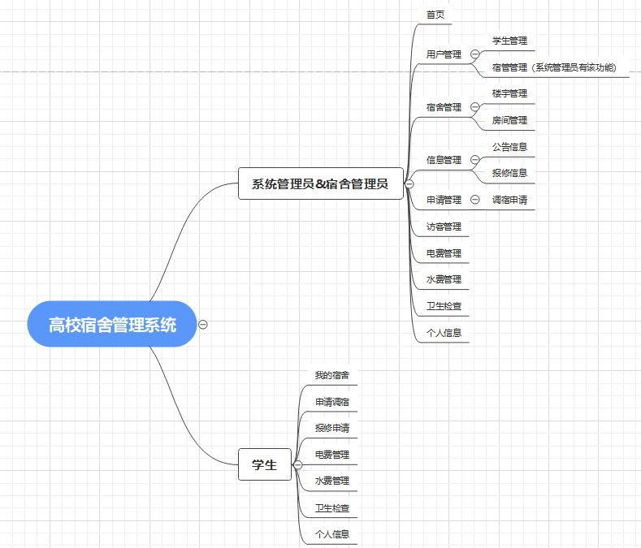 

## 技术服务

## 系统图片
#### 1.登录页面
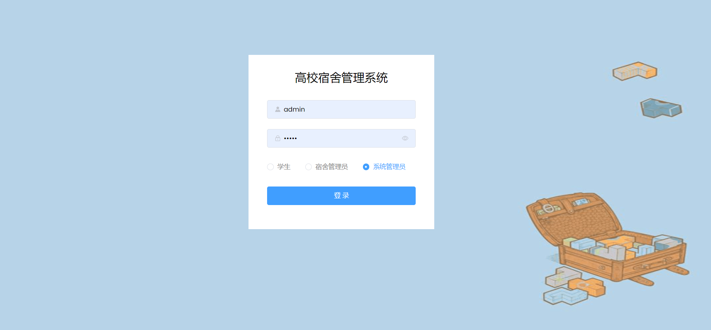 
#### 2.系统首页
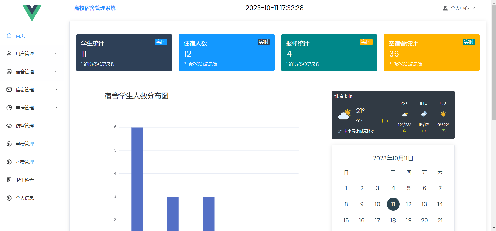 
#### 3.楼宇管理
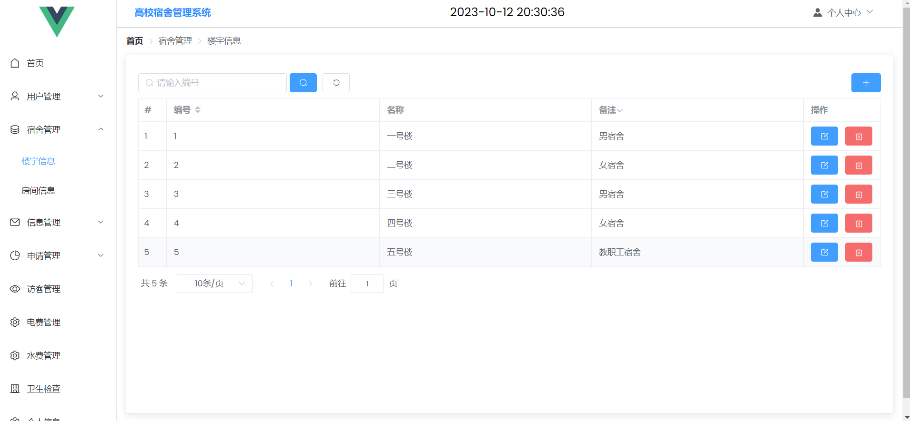 
#### 4.房间管理
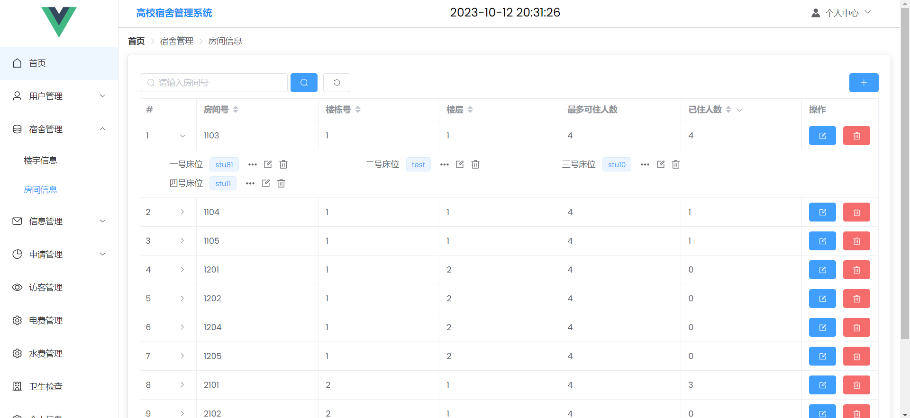 
#### 5.公告管理
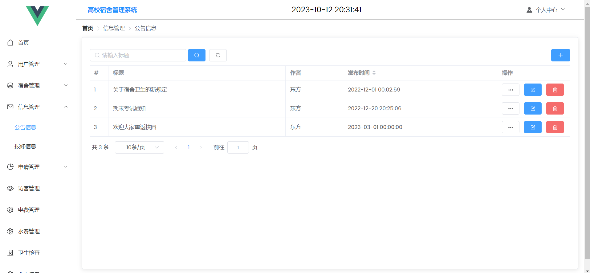 
#### 6.报修管理
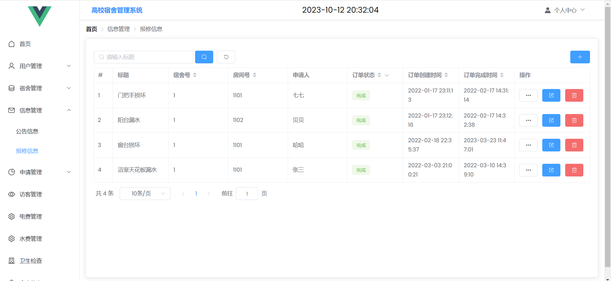 
#### 7.访客管理
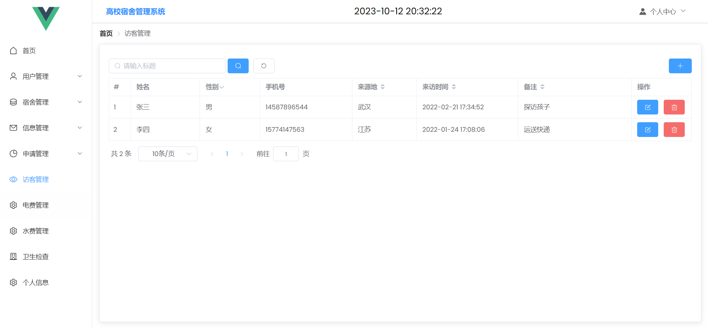 
#### 8.电费管理
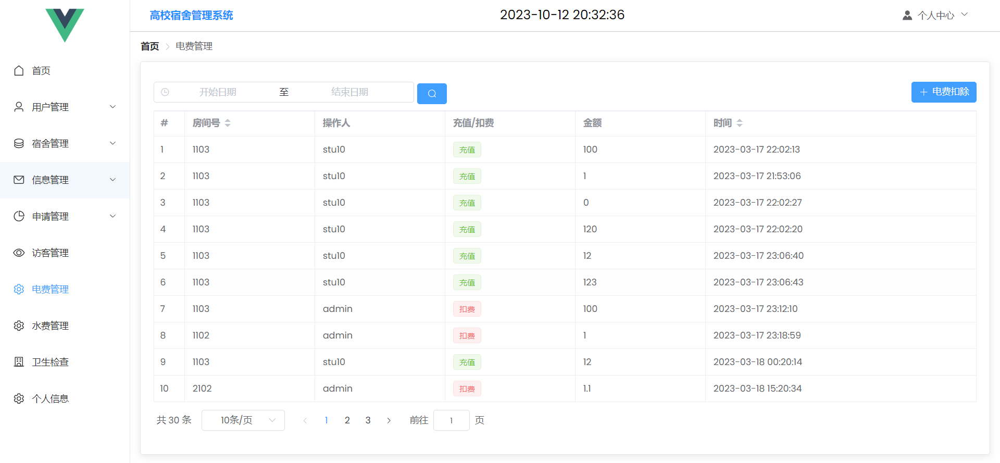 
#### 9.学生-我的宿舍
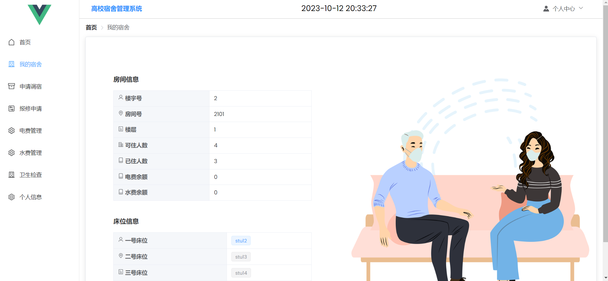 
#### 10.学生-查看宿舍检查通报
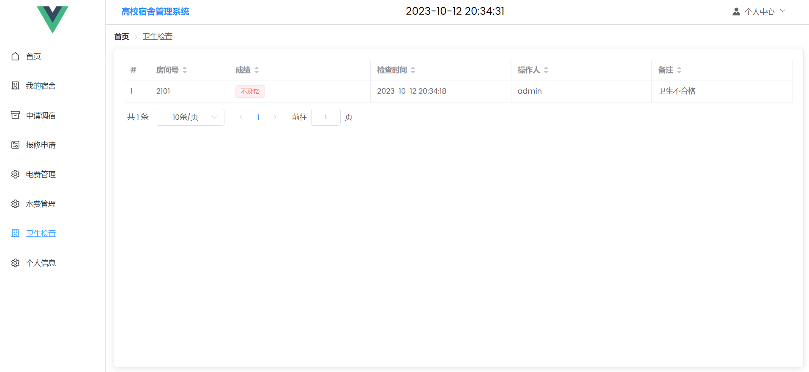 
